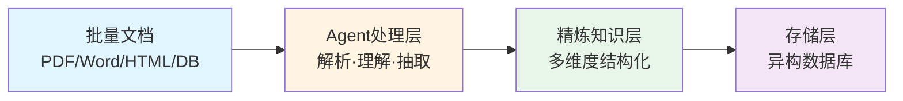
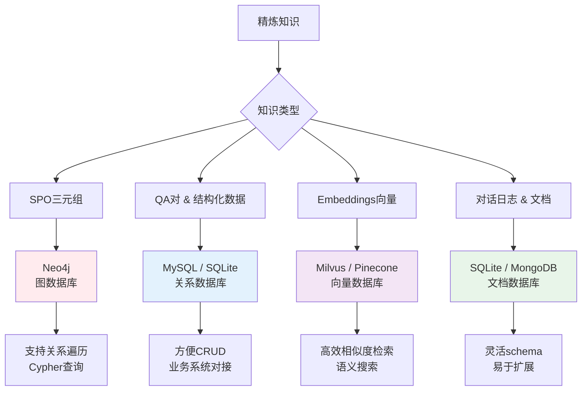
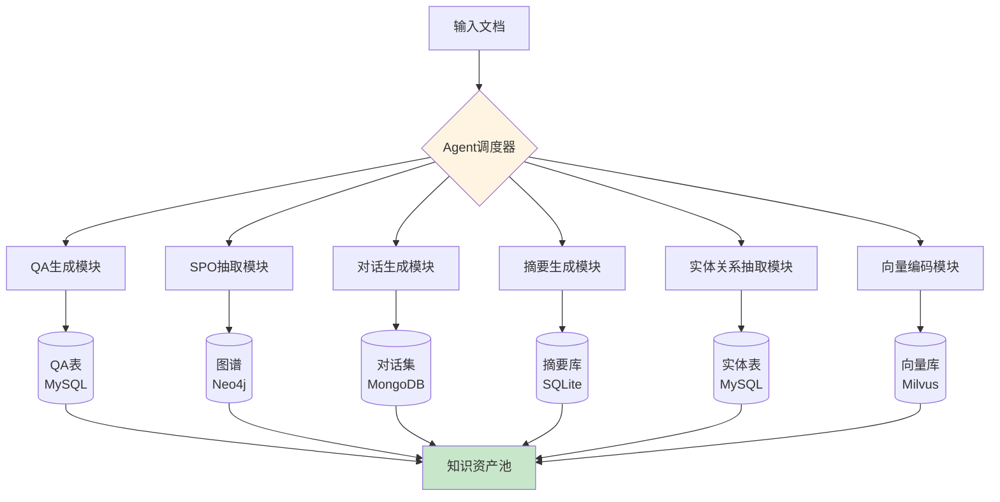
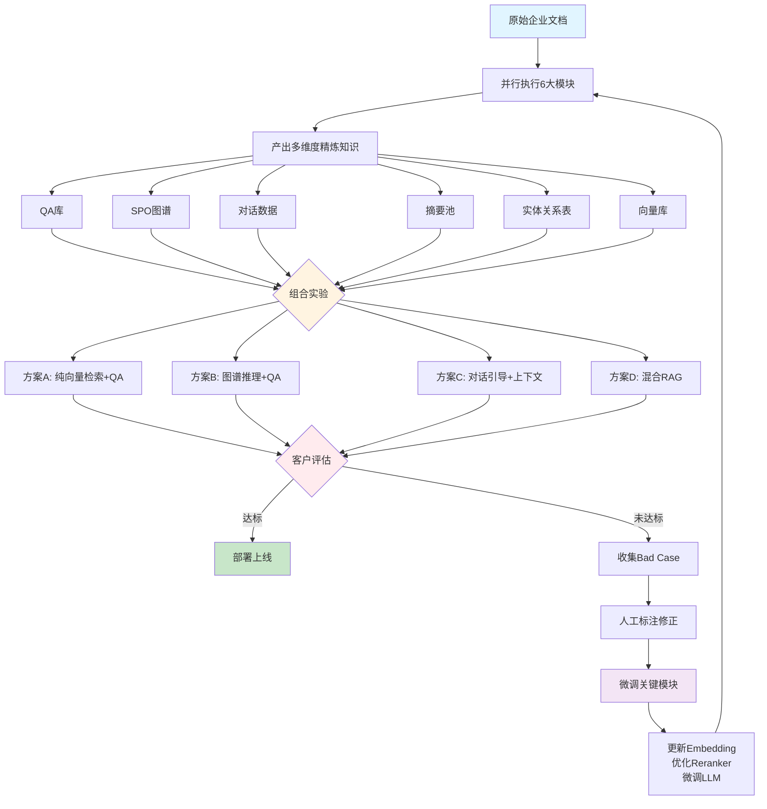
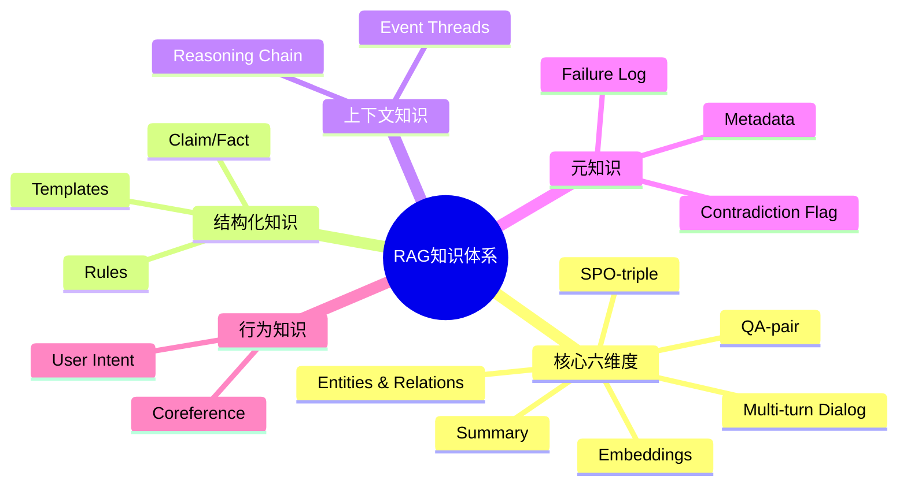
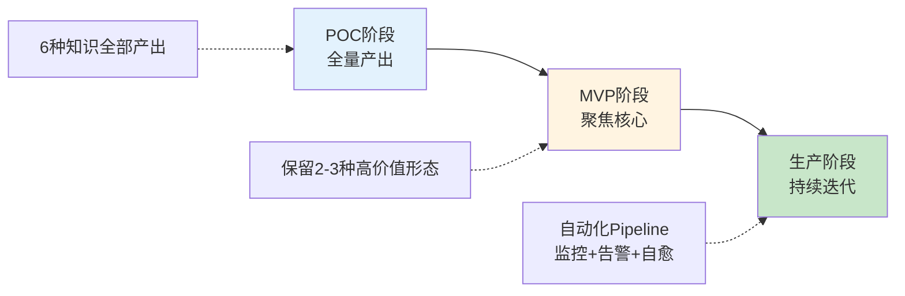

# 企业知识智能体构建实战：从数据到智能的系统化方法论

## 引言

本文将介绍知识智能体构建方法论，从数据处理、知识精炼到工程落地，为企业级RAG系统提供完整的解决方案。

## 一、核心架构：知识智能体的四层模型

企业知识智能体的构建可以抽象为一个清晰的四层流水线：



### 1.1 数据源层
涵盖企业内部的各类文档：技术手册、业务流程、政策制度、客服记录、数据库快照等。

### 1.2 数据解析层
解析层负责文档的读取、解析和理解。可以是RAG检索器+LLM的组合，也可以是专用的信息抽取智能体。

### 1.3 精炼知识层
将原始文档转化为多种结构化知识形态，这是整个系统的核心价值所在。

### 1.4 存储层
根据知识类型特点，采用异构存储策略：图数据库、关系数据库、向量数据库等。

## 二、精炼知识的六大核心形态

从原始文档到可用知识的转化，需要产出以下六种关键形态：

### 2.1 QA-Pair（问答对）

**特点**：自然语言形式的问题-答案配对  
**应用场景**：FAQ系统、客服机器人、检索增强问答  
**质量要求**：
- 问题要口语化，覆盖真实用户提问方式
- 答案要准确、完整，包含必要上下文
- 需考虑一问多答、多问一答的情况

**示例**：
```
Q: 员工年假可以累积到下一年吗？
A: 根据《员工福利手册》第3章，当年未使用的年假可结转至次年第一季度使用，但必须在3月31日前休完，逾期自动清零。
```

### 2.2 SPO-Triple（主谓宾三元组）

**特点**：严格的`<主语, 谓词, 宾语>`结构  
**应用场景**：知识图谱构建、关系推理、可视化分析  
**质量要求**：
- 实体必须规范化（统一不同表述）
- 关系类型需标准化（建立关系词表）
- 适合存储在图数据库（如Neo4j）

**示例**：
```
<公司A, 合作伙伴, 公司B>
<张三, 任职于, 技术部>
<产品X, 依赖, 服务Y>
```

### 2.3 Multi-turn Dialog（多轮对话）

**特点**：保留上下文逻辑的对话序列  
**应用场景**：对话模型训练、智能客服、交互体验测试  
**质量要求**：
- 上下文连贯，意图递进自然
- 包含角色标签（用户/系统）
- 覆盖多种对话模式（澄清、追问、切换话题）

**示例**：
```
用户: 我想申请年假
系统: 请问您计划休假的时间段是？
用户: 下个月15-20号
系统: 您当前年假余额为8天，申请5天后剩余3天。是否确认提交？
用户: 确认
系统: 已成功提交，请在OA系统中等待主管审批。
```

### 2.4 Summary（摘要）

**特点**：全局压缩的信息概括  
**应用场景**：长文档预览、快速浏览、层级检索  
**质量要求**：
- 突出核心信息，舍弃细节
- 长度可分级（100字/300字/500字）
- 保留关键实体和关键结论

### 2.5 Entities & Relations（实体关系）

**特点**：比SPO更细粒度的原材料  
**应用场景**：信息抽取中间产物、后续归一化处理  
**与SPO的区别**：

| 维度 | Entities & Relations | SPO-Triple |
|------|---------------------|------------|
| 结构灵活性 | 可包含属性、类型、置信度 | 严格三元组 |
| 归一化要求 | 可接受别名、模糊表达 | 必须规范化 |
| 处理阶段 | 原材料 | 精炼成品 |

**工程建议**：先抽取E&R → 合并归一 → 生成SPO

### 2.6 Embeddings（向量表示）

**特点**：文本的数值化向量编码  
**应用场景**：语义检索、相似度计算、聚类分析  
**技术选型**：
- 通用场景：sentence-BERT、BGE系列
- 领域定制：可基于精炼数据微调embedding模型
- 存储：Milvus、Pinecone、Qdrant等向量数据库

## 三、存储方案：异构数据库的最佳实践

不同知识形态需要匹配不同的存储引擎：



**混合使用建议**：
- 图谱关系 → Neo4j
- 业务数据 → MySQL
- 向量检索 → Milvus（同时存储原始文本）
- 日志归档 → SQLite/MongoDB

## 四、工程化落地：模块化与并行处理

### 4.1 为什么需要模块化设计？

虽然可以用一个LLM通过不同prompt产出多种知识形态，但从工程化角度，**强烈建议为每个输出维度设计独立模块**：

| 输出类型 | 独立模块的价值 |
|---------|--------------|
| QA-pair | prompt策略不同（口语化、覆盖度），需独立评估 |
| SPO-triple | 实体归一化、关系标准化需要专门处理 |
| Multi-turn dialog | 对话流设计、角色管理需要特殊逻辑 |
| Summary | 压缩策略、层级控制需要单独调优 |
| Entities & Relations | NER+RE pipeline，可能需要专门模型 |
| Embeddings | 向量化模型选择、批量编码优化 |

### 4.2 并行处理架构



**核心优势**：
1. **并行执行**：6个模块同时工作，大幅提升处理速度
2. **独立优化**：每个模块可单独迭代，不影响其他模块
3. **灵活组合**：根据业务需求动态选择使用哪些知识形态

## 五、POC阶段的实战策略

### 5.1 数据驱动的闭环开发

在POC（概念验证）阶段，推荐采用"全量产出、组合实验、快速迭代"的策略：



### 5.2 五阶段落地路线

| 阶段 | 关键动作 | 交付物 |
|------|---------|--------|
| Phase 0 | 选定5-10个代表性文档<br/>定义成功标准（准确率>80%） | 评估基准 |
| Phase 1 | 并行运行所有抽取模块<br/>产出6种精炼知识 | 知识资产池 |
| Phase 2 | 设计3-5种组合策略<br/>搭建Demo（Streamlit/Gradio） | 原型系统 |
| Phase 3 | 邀请客户试用<br/>收集反馈和Bad Case | 评估报告 |
| Phase 4 | 基于Bad Case微调关键模块<br/>优先：Reranker + Embedding | 优化模型 |
| Phase 5 | 输出评估报告<br/>制定迭代路线图 | 决策依据 |

### 5.3 为什么这个策略高效？

1. **快速验证价值点**
   - 客户关心问答 → 展示QA+Milvus方案
   - 客户关心关系挖掘 → 展示Neo4j可视化
   - 客户关心对话体验 → 展示Multi-turn dialog

2. **不锁死技术架构**
   - 发现QA效果不好 → 替换生成模型或加规则后处理
   - 图谱太稀疏 → 补充E&R模块再转SPO
   - 对话生硬 → 用真实日志微调小模型

3. **沉淀数据资产**
   - QA-pair → 微调embedding（对比学习）
   - Dialog → 训练LoRA控制风格
   - Bad Case → 训练reranker强化薄弱点

## 六、进阶：RAG系统的知识扩展维度

除了核心的6种知识形态，还有8个维度值得关注：

### 6.1 元数据增强（Metadata Enrichment）

为每段知识附加结构化元信息：
- 来源文档、章节、页码
- 创建/更新时间
- 作者、部门、密级
- 适用对象、审核状态

**用途**：过滤器检索、权限控制、时间衰减排序

### 6.2 事实陈述（Claim/Fact Statement）

抽取明确可验证的断言句：
- "2024年报显示，公司净利润同比增长18%"
- "员工病假一年累计不得超过30天"

**用途**：对抗LLM幻觉、构建事实库供验证器使用

### 6.3 矛盾与模糊标记（Contradiction Flag）

标注冲突、模糊或未决事项：
- "政策将于2025年Q1实施，具体日期待定" → [未定]
- "部分员工支持新规，也有反馈执行难" → [歧义]

**用途**：预警冲突信息、引导LLM加免责声明

### 6.4 推理链（Reasoning Chain）

保留推导过程和依据路径：
```
问：为什么不能在周末提交报销？
答：
  依据：《财务制度V3.2》第5章第3条
  → 原因：银行对公系统周末关闭
  → 结论：截止时间为周五17:00
```

**用途**：提升可信度、增强可解释性

### 6.5 领域模板与规则（Domain Templates）

提炼可复用的语义模板：
```
模板："{员工姓名}的{假期类型}余额为{数字}天，有效期至{日期}"
规则："产假申请需提前{X}天提交，且提供{材料清单}"
```

**用途**：标准化回复、规则引擎协同、提升合规性

### 6.6 用户意图模式（User Intent Patterns）

从历史日志聚类高频意图：
- Intent: "查政策有效期" → 关联"时间字段"
- Intent: "对比产品差异" → 召回"结构化对比表"

**用途**：意图路由、个性化召回、对话引导

### 6.7 失败案例库（Failure Case Log）

记录系统答错的问题及原因：
```json
{
  "question": "产假能和年假叠加吗？",
  "wrong_answer": "可以叠加",
  "correct_answer": "根据HR通知，产假期间不计入年假，不可叠加",
  "reason": "未识别'叠加'的特殊定义",
  "improve_by": "添加规则过滤关键词'叠加'+'假期'"
}
```

**用途**：监控性能衰退、训练reranker、微调LLM

### 6.8 跨文档事件线（Event Threads）

识别多文档中的同一实体/事件：
- 文档A："项目Alpha于2024启动"
- 文档B："Alpha项目预算追加500万"
- → 合并为：`<Alpha项目>: 2024启动 → 2025预算追加`

**用途**：解决碎片化知识、支持复杂溯源查询

## 七、完整的RAG知识体系地图



## 八、行业定制化建议

根据不同行业特点，优先选择适配的知识维度：

| 行业 | 必选维度 | 推荐扩展 |
|------|---------|---------|
| 金融 | QA + SPO + Claim | 时间轴抽取、合规标记 |
| 医疗 | Entities + Reasoning Chain | 诊疗路径、禁忌标注 |
| 法律 | SPO + Claim + Reasoning | 法规引用、争议点检测 |
| HR | QA + Templates + Rules | 流程模板、权限控制 |
| 制造 | SPO + Event Threads | 故障溯源、依赖图谱 |

## 九、总结与核心要点

### 9.1 构建企业知识智能体的黄金法则

1. **模块化设计**：每种知识形态独立模块，便于迭代优化
2. **并行处理**：多模块同时工作，提升数据处理效率
3. **组合实验**：不同知识形态灵活组合，快速验证价值
4. **数据闭环**：Bad Case → 标注 → 微调 → 更新知识库
5. **分层存储**：异构数据库各司其职，发挥最大效能

### 9.2 POC成功的三个关键

- **小范围验证**：5-10个代表性文档快速启动
- **多方案对比**：3-5种组合策略并行测试
- **优先Reranker**：最快见效的优化点是reranker和embedding

### 9.3 从POC到生产的演进路径



### 9.4 最终目标

> **不是要做"更多的知识"，而是要做"能让RAG系统更聪明、更可控、更可信任的知识"。**

通过系统化的知识精炼方法论，企业可以：
- 将静态文档转化为可查询的智能知识库
- 用数据驱动的方式持续优化系统性能
- 在可控的风险下快速验证AI应用价值
- 沉淀宝贵的数据资产，支撑长期模型迭代

---

## 附录：快速启动检查清单

- [ ] 选定代表性文档（5-10个）
- [ ] 定义成功标准（准确率、覆盖率、响应时间）
- [ ] 部署6大抽取模块（可用开源LLM+prompt）
- [ ] 配置异构存储（MySQL/Neo4j/Milvus至少各一个）
- [ ] 构建简易Demo界面（Streamlit/Gradio）
- [ ] 设计3种组合方案（如：纯检索/图谱增强/混合RAG）
- [ ] 邀请3-5个种子用户测试
- [ ] 建立Bad Case收集机制
- [ ] 准备微调数据管道（优先reranker）
- [ ] 输出评估报告与迭代计划

---

**从一个小范围的POC开始，用数据说话，用效果证明，逐步构建你的企业级知识智能体。**