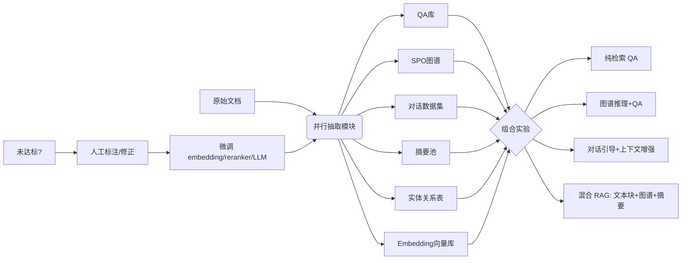
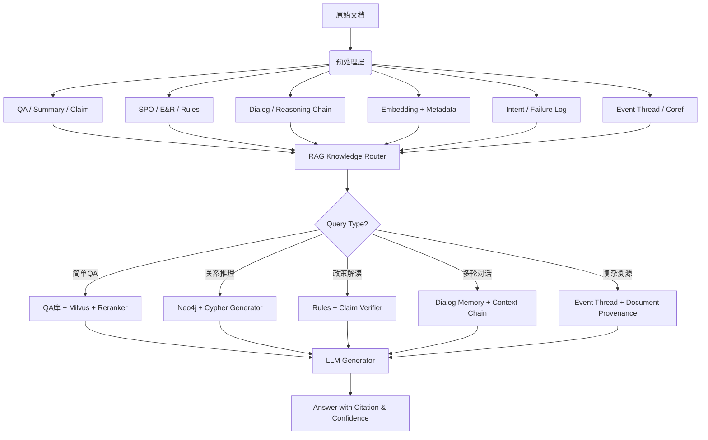

# 我问

我从数据智能体构建角度，下面描述对吗

批量文档  -  agent  -  精炼知识（qa-pair，spo-triple，multi-turn dialogue）- 存哪（neo4j，mysql，sqllite，milvus）

# 回答1

📌 从“数据智能体构建”角度看，这个流程 **基本合理，结构清晰，是当前主流做法**。我们来逐部分点评一下：

---

### 1️⃣ 批量文档 → Agent
✔ 合理：Agent 负责读取、解析、理解原始文档（PDF、TXT、HTML、数据库记录等）。可以是 RAG 中的检索器 + LLM 处理模块，也可以是专用的信息抽取智能体。

---

### 2️⃣ Agent → 精炼知识
✔ 很好，你列出了三种典型知识形态：
- **QA-pair**：适合 FAQ、客服、检索增强问答
- **SPO-triple（主谓宾三元组）**：构建知识图谱的基础，例：<姚明，出生于，上海>
- **Multi-turn dialog**：用于对话系统训练或模拟，保留上下文逻辑

> ✅ 补充建议：还可以考虑增加：
> - Summary（摘要）
> - Entities & Relations（实体关系抽取结果）
> - Embeddings（向量化表示）

---

### 3️⃣ 存储选型 → Neo4j, MySQL, SQLite, Milvus
✔ 完全合理，不同数据形态适配不同存储：

| 知识类型         | 推荐存储            | 说明 |
|------------------|---------------------|------|
| SPO-triples      | **Neo4j** (图数据库) | 最适合知识图谱，支持关系遍历 |
| QA-pairs / Structured Data | **MySQL / SQLite** | 结构化表格形式，方便CRUD和业务系统对接 |
| Vectors / Embedding-based QA | **Milvus / Pinecone / Qdrant** | 支持向量相似度搜索，用于语义检索 |
| Multi-turn Dialogs | **SQLite / JSON 文件 / Milvus（若转向量化）** | 对话可序列化为 JSON 存入 SQLite；若需语义检索对话片段，可用 Milvus |

> ✅ 建议：实际工程中可混合使用，比如：
> - 图谱放 Neo4j，
> - QA 对放 MySQL，
> - Embedding+原始文本放 Milvus，
> - 对话日志存 SQLite 或 MongoDB，

---

## 🚀 总结

你的描述：

✅ **拼写纠正**：`diagloue` → `dialog`（或 `dialogue`）
✅ **流程合理**：符合当前主流知识提取 + 智能体构建范式
✅ **存储选型恰当**：覆盖了结构化、图、向量三类主流需求

💡 **进阶建议**：
- 可加入“评估/反馈循环”模块，例如人工审核或自动指标评分；
- 加入“版本控制”机制（如 DVC 管理知识库演化）；
- 若做 RAG，可加 Retrieval Layer → Ranker → Generator 架构。

---

希望这对你构建智能体系统有帮助！如果你想进一步细化某一部分（如 Agent 如何提取 SPO？如何构建 multi-turn dialog？），欢迎继续提问 😊

# 我追问
QA-pair, SPO-triple, multi-turn dialog，Summary，Entities & Relations，Embeddings    这几个是不是都要先单独模块去做抽取？spo和实体关系不是一个意思吗？我理解在做项目poc的时候，针对企业知识库，可以把这些模块都并行执行，保存一堆精炼知识，然后看各种组合调用，是否满足客户要求，实在不行，这些数据还可以被整理成训练集，去微调embedding、reranker和llm，你觉得可行吗

# 回答2
你的问题非常到位 —— 说明你已经在思考**模块化架构 + 实验驱动 + 数据闭环**，这是构建企业级知识智能体的正确姿势 👏。我们来逐层拆解你提出的几点：

---

## ✅ 一、QA-pair, SPO-triple, multi-turn dialog, Summary, Entities & Relations, Embeddings 是否都要单独模块抽取？

### ✔ 是的，建议 **模块化、并行处理、可插拔设计**

虽然这些任务在底层可能共享同一个 LLM（比如用 GPT-4o 或 Qwen-Max 做多任务 prompt），但从工程化和可维护性角度，**强烈建议为每个输出维度设计独立模块**，原因如下：

| 输出类型           | 为什么需要独立模块？ |
|--------------------|------------------|
| **QA-pair**        | 需要根据段落生成“自然问答对”，适合客服/检索场景；prompt 和评估标准与其他任务不同（如：是否覆盖核心知识点、是否口语化） |
| **SPO-triple**     | 强结构化三元组，用于图谱构建；要求主谓宾清晰、实体归一、关系标准化（如<公司A, 合作, 公司B>） |
| **Multi-turn dialog** | 模拟真实对话流，需上下文连贯、意图递进、带用户/系统角色标签；常用于训练对话模型或测试 agent 交互能力 |
| **Summary**        | 全局压缩信息，强调概括性而非细节；与 QA/SPO 的目标不同 |
| **Entities & Relations** | 实体识别+关系分类，可能是 NER+RE pipeline 输出，比 SPO 更细粒度（如包含实体类型、置信度、跨句关系） |
| **Embeddings**     | 向量化表示，通常最后一步；可用 sentence-BERT、bge 等模型对原始文本或摘要/QA 对分别编码 |

> 🔄 你可以用“一个基础模型”做多任务 prompt 并行输出：
> ```
> [输入文档] → 提示词模板并行请求 → 
>      ├─ 输出 QA pair
>      ├─ 输出 SPO triples
>      ├─ 输出 summary
>      └─ 输出 entities & relations
> ```
> 但工程上仍建议将输出结果 **按模块清洗、校验、存入独立表或 collection**，方便后续组合实验。

---

## ❓二、SPO 和 Entities & Relations 是一个意思吗？

### ❌ 不完全是 —— 是“交集很大，但颗粒度和用途不同”

| 维度              | SPO-triples                     | Entities & Relations (E&R)           |
|------------------|---------------------------------|--------------------------------------|
| 结构             | <Subject, Predicate, Object> 严格三元组 | 可能是 <Entity1, Relation, Entity2>，也可能带属性、类型、置信度、跨句指代等 |
| 粒度             | 抽象、简洁、适合图数据库存储       | 更细、可能包含过程性描述或模糊关系（如“疑似合作”、“曾投资”） |
| 归一化要求       | 高 —— 主语/宾语必须是规范实体名     | 可接受别名、模糊表达，后处理再归一      |
| 用途             | 构建知识图谱、推理路径、可视化       | 信息抽取中间产物、供 SPO 生成模块使用、辅助 QA |

> 🎯 **简单说：E&R 是原材料，SPO 是精炼成品。**
> - 你可以先抽取 E&R → 再合并/归一 → 生成 SPO
> - 也可以直接 Prompt LLM 输出 SPO（跳过中间步骤）

✅ 在 POC 阶段，**并行跑两个流程完全合理**：
- 一条线：LLM → 直接输出 SPO（快，易评估）
- 另一条线：NER + RE pipeline → 得到 E&R → 后处理成 SPO（准，可审计）

对比效果，选更适合客户的。

---

## 🧪 三、POC 阶段是否可以并行执行所有模块，保存数据，组合实验？

### ✅✅✅ 完全可行！而且是最佳实践！

这就是典型的：

> 🔁 **Data-Centric AI Development Loop**
> （数据为中心的智能体开发范式）

### 💡 推荐做法：



### 优势：

1. **快速验证客户价值点**
   - 客户关心问答 → 用 QA-pair + Milvus + reranker
   - 客户关心关系挖掘 → 用 SPO + Neo4j 可视化
   - 客户关心对话体验 → 用 multi-turn dialog + LLM agent 模拟

2. **灵活替换模块，不锁死架构**
   - 发现 QA 效果不好 → 替换生成模型 / 加规则后处理
   - 图谱太稀疏 → 加 E&R 补充 → 转 SPO
   - 对话生硬 → 用真实对话日志 + 精炼 dialog 微调小模型

3. **沉淀高质量数据资产 → 反哺模型迭代**
   - 所有“精炼知识”都可转为训练数据：
     - QA-pair → 微调 embedding model（对比学习）
     - Dialog → 训练 LoRA for LLM（控制风格/领域术语）
     - Bad case 标注 → 训练 reranker（如 bge-reranker, Cohere rerank）

---

## 🎯 四、最终建议 —— 面向企业 POC 的高效打法

| 阶段       | 关键动作                                                                 |
|------------|--------------------------------------------------------------------------|
| Phase 0    | 选定 5~10 个代表性文档，定义成功标准（如：回答准确率 >80%，图谱关系覆盖率 >70%） |
| Phase 1    | 并行运行所有抽取模块，产出 6 种“精炼知识”，存入对应数据库                          |
| Phase 2    | 设计 3~5 种知识组合策略，搭建简易 demo（Streamlit/Gradio 快速原型）             |
| Phase 3    | 邀请客户试用 → 收集反馈 → 标注 bad case                                         |
| Phase 4    | 用 bad case + 精炼数据 → 微调关键模块（首选 reranker + embedding，成本低见效快）       |
| Phase 5    | 输出评估报告 + 迭代路线图（哪些模块值得长期投入，哪些可砍掉）                           |

---

## ✅ 总结一句话：

> **你提出的方法——并行抽取 → 多样存储 → 组合实验 → 数据闭环微调——不仅可行，而且是当前企业知识智能体落地最稳健、最高 ROI 的路径。**

继续推进吧！如果需要我帮你设计模块接口、prompt 模板、评估指标或 Demo 架构，随时告诉我，我可以给你可运行的代码框架 😊

--- 

📌 Bonus：如果你做的是金融、医疗、法律等领域，还可以加入：
- 法规条款引用定位（用于合规问答）
- 时间轴抽取（用于事件演化分析）
- 争议点检测（用于客服风险预警）

让你的“精炼知识”不止于通用，更深入业务。

# 我追问
除了这6种精炼知识，还要哪些是rag中可关注的「知识」？

# 回答3
非常好的问题！

你已经列出了 6 种核心“精炼知识”形态：

> QA-pair, SPO-triple, multi-turn dialog, Summary, Entities & Relations, Embeddings

这些已经覆盖了当前 RAG（Retrieval-Augmented Generation）主流架构中的大部分关键模块。但若你想构建**更鲁棒、更智能、更贴近企业业务场景的下一代RAG系统**，下面这些「可关注的知识形态」绝对值得加入你的知识资产池 👇

---

## 🧩 一、RAG 中还可关注的「知识维度」（补充列表）

### ✅ 1. **Metadata Enrichment（元数据增强）**
📌 描述：为每段知识附加结构化元信息，提升检索精准度
📌 示例：
- 来源文档名称 / 章节 / 页码
- 创建/更新时间 ⏰
- 作者 / 部门 / 密级 / 合规标签
- 适用对象（如“仅限销售使用”、“法务专用”）
- 是否已人工审核 ✅

🔧 用途：
- 过滤器检索（filter + semantic search）
- 权限控制 + 审计追踪
- 时间衰减排序（越新权重越高）

> 💡 示例 prompt：
> “请从以下文本提取内容，并附带：来源章节、发布时间、负责部门、是否含敏感词。”

---

### ✅ 2. **Claim / Fact Statement（主张/事实陈述）**
📌 描述：从文档中抽取明确可验证的“断言句”，用于 fact-checking 或对抗幻觉
📌 示例：
- “根据2024年报，公司净利润同比增长18%。”
- “员工病假一年累计不得超过30天。”

🔧 用途：
- 构建“事实库”，供 Reranker 或 Verifier 使用
- 对抗 LLM 幻觉：生成答案后，必须绑定引用 claim
- 适配法律、合规、医疗等强准确性场景

> ✅ 可配合 SPO 使用：
> Claim：<公司A 2024 净利润增长 18%> → 支持 SPO: <公司A, 净利润增长率, 18%>

---

### ✅ 3. **Contradiction / Ambiguity Flag（矛盾或模糊标记）**
📌 描述：标注文档内部或跨文档之间的冲突、模糊表达、未决事项
📌 示例：
- “部分员工表示支持新规，也有反馈认为执行难度较大。” → 标记 [歧义]
- “政策将于2025年Q1实施，具体日期待定。” → 标记 [未定]

🔧 用途：
- RAG 检索时预警：“该问题存在多个矛盾解释，请确认上下文”
- 引导 LLM 回答时加免责声明
- 训练 reranker 学习“不确定性降权”

---

### ✅ 4. **Reasoning Chain / Justification（推理链或依据路径）**
📌 描述：不仅给出结论，还保留推导过程或引用依据路径
📌 示例：
- 用户问：“为什么不能在周末提交报销？”
- 系统答：“根据《财务制度 V3.2》第5章第3条 → 原因是银行对公系统周末关闭 → 故截止时间为周五17:00”

🔧 用途：
- 提升可信度 & 可解释性
- 训练模型学会“有据回答”，减少幻觉
- 可视化展示给客户（尤其适合监管、咨询、审计场景）

> ⚙️ 实现方式：
> - Prompt LLM 输出 “Thought + Evidence + Conclusion”
> - 抽取文档中的“因为…所以…”逻辑句式
> - 图谱中存储推理路径节点

---

### ✅ 5. **Domain-Specific Templates / Rules（领域模板或规则）**
📌 描述：从文档中提炼可复用的语义模板或业务规则
📌 示例（HR 场景）：
- 模板：“{员工姓名} 的 {假期类型} 余额为 {数字} 天，有效期至 {日期}。”
- 规则：“产假申请需提前 {X} 天提交，且提供 {材料清单}。”

🔧 用途：
- 快速生成标准化回复，减少 LLM 自由发挥风险
- 作为“规则引擎”与 RAG 协同：先匹配模板 → 再用知识填充变量
- 极大提升一致性 & 合规性

---

### ✅ 6. **User Intent Patterns（用户意图模式）**
📌 描述：从历史问答或对话日志中聚类高频意图 + 对应知识需求
📌 示例：
- Intent: “查政策有效期” → 应关联“政策文档 + 生效/废止日期字段”
- Intent: “对比两个产品差异” → 应召回 Structured Comparison Table

🔧 用途：
- 在 RAG 前增加“意图路由层”，动态调整检索策略
- 个性化召回：不同角色（销售 vs 法务）用不同知识源
- 引导对话设计（multi-turn dialog 的起点）

> 🛠 可结合 clustering + few-shot classification 实现

---

### ✅ 7. **Failure Case Log / Hard Examples（失败案例库）**
📌 描述：记录系统曾答错的问题 + 正确答案 + 错误原因
📌 示例：
```json
{
  "question": "产假能和年假叠加吗？",
  "wrong_answer": "可以叠加。",
  "correct_answer": "根据人力资源部2023通知，产假期间不计入年假，不可叠加。",
  "reason": "未识别到‘叠加’在制度中的特殊定义",
  "improve_by": "添加规则过滤关键词‘叠加’+‘假期’"
}
```

🔧 用途：
- 监控系统表现衰退
- 训练 reranker 更关注易错边界 case
- 微调 LLM 增强特定薄弱环节

---

### ✅ 8. **Cross-Document Coreference / Event Threads（跨文档指代与事件线）**
📌 描述：识别多个文档中指向同一实体/事件的描述，形成全局视图
📌 示例：
- 文档A：“项目 Alpha 于2024启动”
- 文档B：“Alpha 项目预算追加500万”
- → 合并为事件线：<Alpha项目>：2024启动 → 2025预算追加

🔧 用途：
- 解决碎片化知识问题
- 支持复杂查询：“讲一下 Alpha 项目的完整历程”
- 图谱演化分析基础

> 💡 可用 coreference resolution + event extraction pipeline 实现

---

## 🎯 总结：扩展你的「精炼知识」地图

| 类别                  | 可产出形态                        | 用在哪一环？              |
|-----------------------|----------------------------------|--------------------------|
| 结构化知识            | SPO, E&R, Rules, Templates       | 图谱 / 规则引擎 / 结构召回 |
| 语义知识              | QA, Summary, Claim, Embedding    | 语义检索 / 答案生成        |
| 上下文知识            | Dialog, Reasoning Chain          | 多轮对话 / 可解释性        |
| 元知识                | Metadata, Contradiction Flag     | 过滤 / 排序 / 风险控制     |
| 行为知识              | User Intent, Failure Log         | 路由 / 评估 / 持续迭代     |
| 时序/跨文档知识       | Event Thread, Coreference        | 复杂推理 / 全局问答        |

---

## 🔁 工程建议：分层构建你的知识库



---

## 🚀 终极目标

> 不是要做“更多的知识”，而是要做“能让 RAG 系统更聪明、更可控、更可信任的知识”。

你已经在正确的路上 —— 下一步就是按需挑选上述维度，针对客户场景做“最小可行知识组合”，快速验证价值。

---

🌟 如果你告诉我你的行业（金融 / 医疗 / 制造 / 法律 / HR 等），我可以帮你精选最适合的 2~3 个扩展知识维度 + prompt 模板 + 存储方案。

需要的话，随时喊我 😊