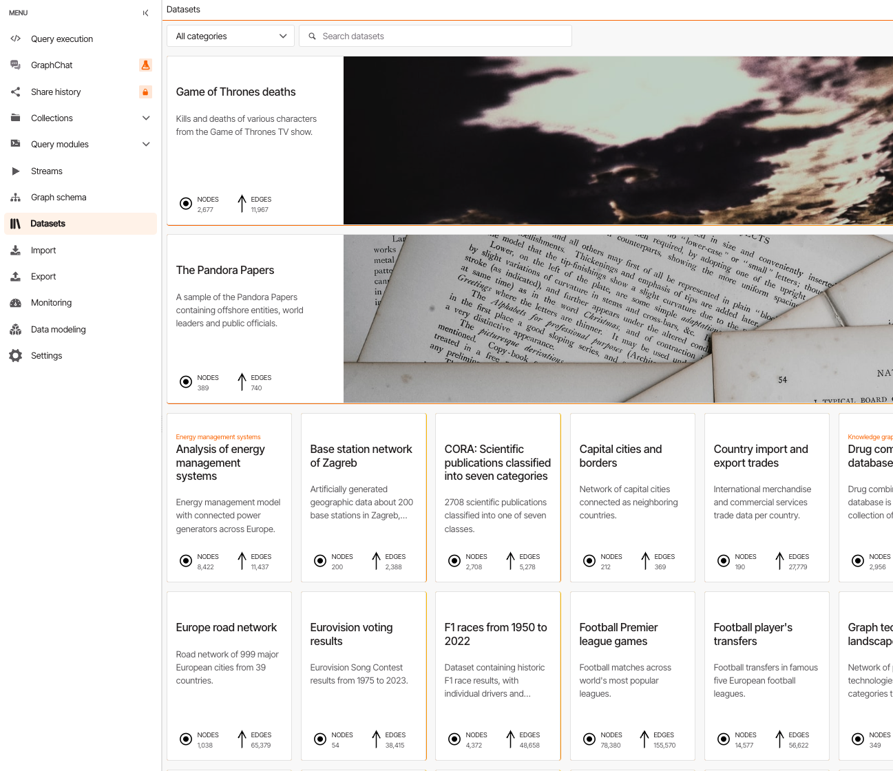
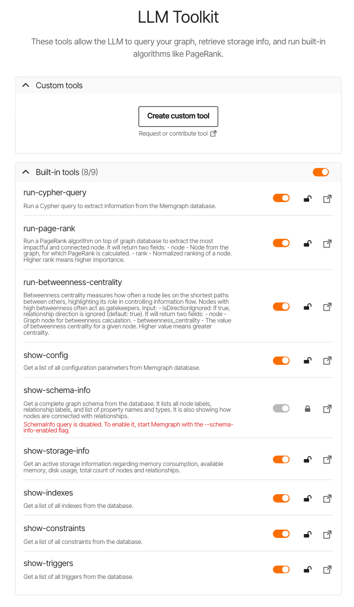

# Memgraph：支持时变特征的图数据库与 GraphRAG 实践

## 为什么关注 Memgraph？

最近在看 RAGFlow 的技术推文时，看到一条有意思的评论：


这位网友提到了一个痛点：**大多数 GraphRAG 都是静态图，缺少支持时变特征的图数据库**。这让我开始关注 Memgraph 这个数据库。更值得一提的是，NASA 已经正式采用 Memgraph 作为 Neo4j 的替代方案，这说明它在性能和功能上确实有独特优势。

## Memgraph 是什么？


Memgraph 是一款**兼容 Neo4j 的开源图数据库**，但它的设计目标更聚焦：**实时流处理**。简单来说：

- **内存优先架构**：用 C/C++ 开发，数据在内存中处理，查询速度快
- **实时数据接入**：可以直接对接 Kafka、SQL 或 CSV，动态更新图数据
- **Cypher 查询语言**：和 Neo4j 一样使用 Cypher，学习成本低
- **动态算法支持**：PageRank、社区检测等算法支持增量更新，不用每次全量计算

这里的"时变特征"指的就是图可以实时更新，算法可以增量计算，而不是传统的静态快照方式。

## 快速上手

### 安装

在 macOS 或 Ubuntu 上，确保 Docker Desktop 已启动，然后执行：

```bash
curl -sSf "https://install.memgraph.com" | sh
```

安装完成后，在浏览器打开 `http://localhost:3000` 即可访问 Memgraph Lab 界面。

### 加载样例数据集

Memgraph 提供了丰富的样例数据集，比如《权力的游戏》（2677 个节点，11967 条边）、潘多拉文件等。数据集可以直接从 Lab 界面加载：



有意思的是，这些数据集在 load 的时候其实是 CSV 格式：


### 使用 GraphChat 与数据库对话

Memgraph 提供了一个 GraphChat 功能，可以配置 DeepSeek 等大语言模型，通过自然语言查询图数据库：


配置完成后，你可以直接问数据库问题，LLM 会自动调用工具完成查询：


## GraphRAG 核心能力

Memgraph 在 GraphRAG 场景下提供了一套完整的工具链，这也是它和传统图数据库的主要区别：


### LLM 工具包

Memgraph 提供了一组内置工具，让 LLM 可以与图数据库交互：



主要工具包括：
- **run-cypher-query**：运行 Cypher 查询
- **run-page-rank**：计算节点影响力
- **run-betweenness-centrality**：计算中介中心性
- **show-schema-info**：查看图结构（需要在 docker-compose.yml 中开启）
- **show-storage-info**：查看存储信息

如果要开启 `show-schema-info`，需要修改 docker-compose.yml：


### GraphRAG 架构

Memgraph 的 GraphRAG 架构如下：


核心流程：
1. **结构化数据**：将实体和关系建模成图
2. **向量搜索**：支持语义检索，找到相关节点
3. **关系扩展**：通过深度路径遍历，获取多跳关系
4. **社区检测**：使用 Leiden/Louvain 算法找到相关社区
5. **实时更新**：图可以动态接入流数据，算法增量计算

特别值得一提的是**动态算法**支持。传统的 PageRank 或社区检测需要全量计算，但 Memgraph 提供了 Dynamic PageRank 和 Dynamic Community Detection，可以在图更新时增量计算，这对于实时场景非常重要。

## Agentic GraphRAG 实践

Memgraph 提供了一系列 AI Demos，展示了如何构建不同场景的 GraphRAG 应用：

### 知识图谱构建
- 从《麦田里的守望者》、《权力的游戏》等文本中提取实体和关系
- 使用 SpaCy 进行实体识别
- 可视化知识图谱

### 检索策略
- **向量搜索**：基于 embedding 的语义检索
- **深度路径遍历**：多跳查询
- **社区检测**：Leiden 算法比 Louvain 更快更准

### Agentic GraphRAG
这是最高级的用法：构建一个**自主智能体**，它可以：
1. 接收用户问题
2. 自动选择检索策略（向量搜索 + 图遍历 + 社区检测）
3. 整合 Memgraph、Sentence Transformers 和 GPT 模型
4. 生成基于知识图谱的回答

相关代码在 [Memgraph AI Demos](https://github.com/memgraph/memgraph-ai-demos) 仓库中，包含了完整的实现示例。

### 框架集成
Memgraph 已经集成了主流的 AI 框架：
- **LangChain**：知识图谱构建
- **LangGraph**：图感知智能体
- **LlamaIndex**：单/多智能体 RAG 系统
- **Cognee**：从自然语言构建语义知识图谱
- **LightRAG**：轻量级 RAG 框架


## 医疗场景示例

Memgraph 官网给出了一个医疗记录的 GraphRAG 示例：


通过将患者、疾病、治疗、医生等信息建模成图，可以：
- 快速找到相似病例
- 追踪疾病传播路径
- 推荐治疗方案
- 实时更新医疗知识图谱

## 总结

Memgraph 的核心优势在于：
1. **实时性**：内存架构 + 流数据接入 + 动态算法
2. **时变特征**：图可以实时更新，算法可以增量计算
3. **GraphRAG 友好**：内置向量搜索、社区检测等算法
4. **AI 集成**：与主流 LLM 框架无缝集成

如果你的场景需要实时更新的知识图谱（比如新闻监控、金融风控、供应链追踪），或者想构建一个动态的 GraphRAG 系统，Memgraph 是一个值得尝试的选择。

不过需要注意的是，Memgraph 社区版基于 BSL 许可证，企业版基于 MEL 许可证，使用前需要了解清楚许可限制。

## 参考资料
- [Memgraph 官网](https://memgraph.com/)
- [Memgraph GitHub](https://github.com/memgraph/memgraph)
- [Memgraph AI Demos](https://github.com/memgraph/memgraph-ai-demos)
- [Memgraph GraphRAG 文档](https://memgraph.com/graphrag)

