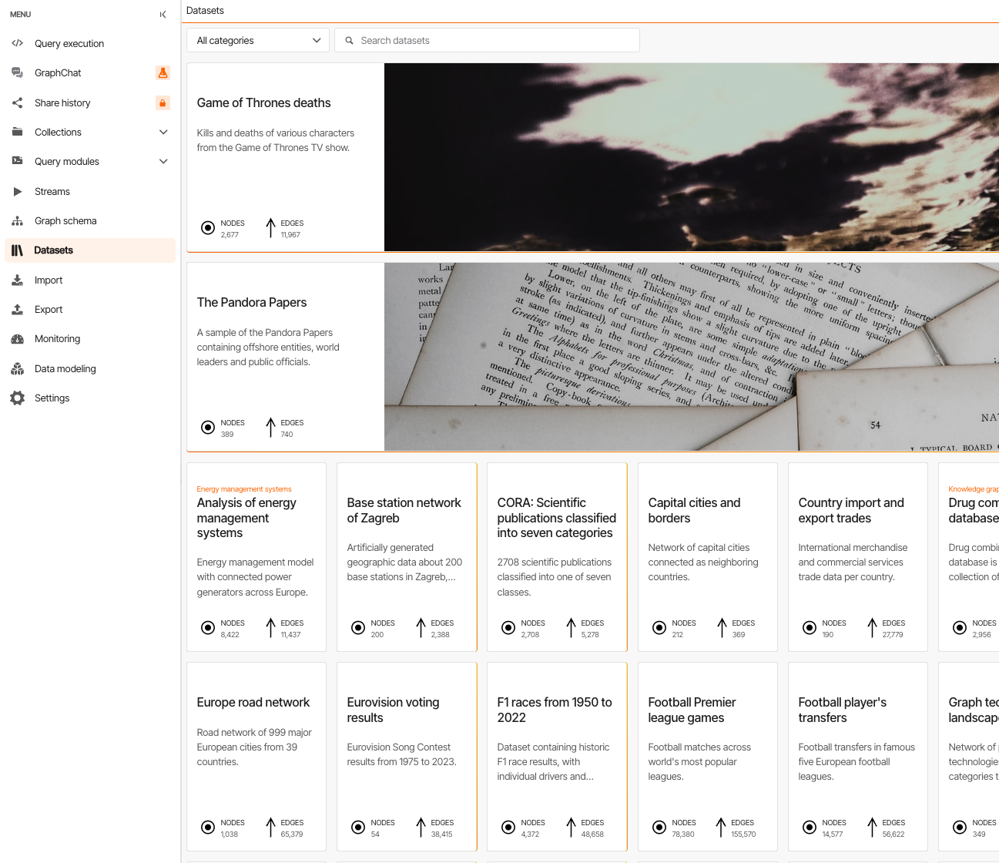
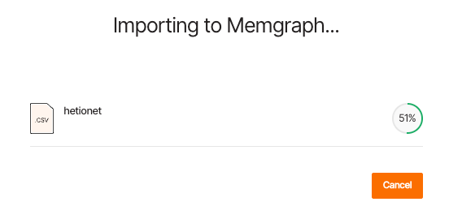
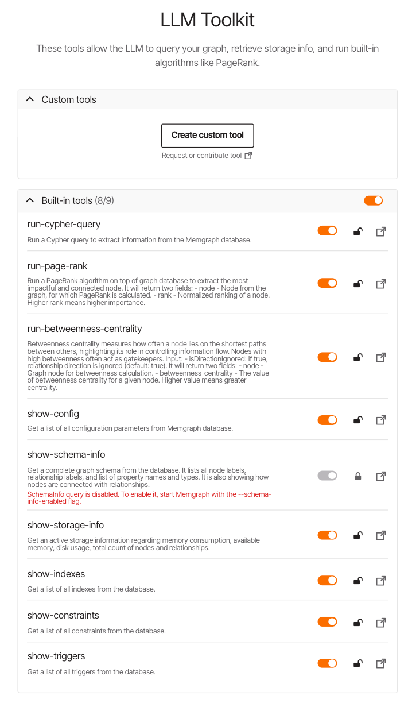
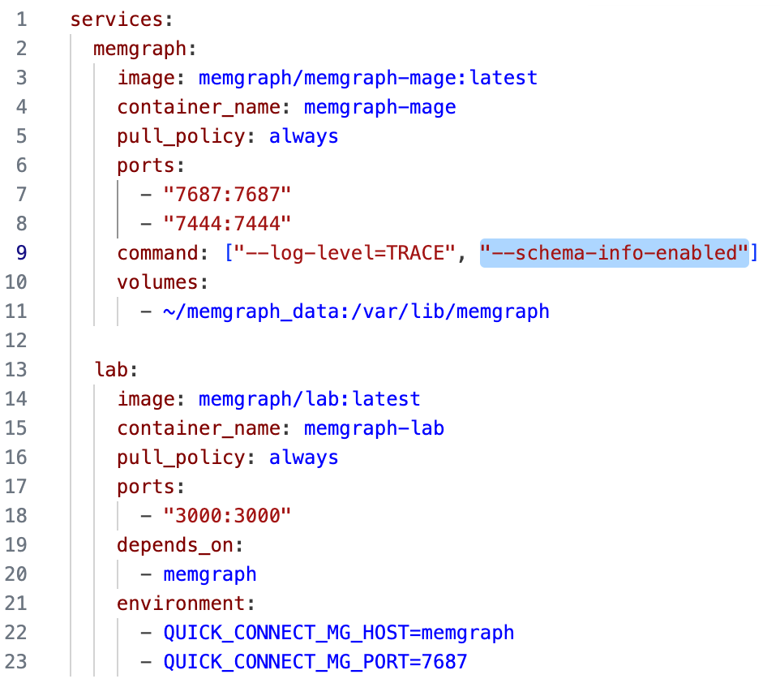

那看一篇推文：[多模态 RAG 以文搜图在 RAGFlow 中的实践，自动化测试为 API 质量保驾护航，KnowFlow 全新 UI 重磅来袭](https://mp.weixin.qq.com/s/lZuTcOerD71nTs3m_fb8ag)

看到底下第一个网友的评论「可考虑集成支持时变特征的图数据库，稀缺功能，大多数GraphRAG都是静态图」，让我产生了深思。

# memgraph
## 介绍
Memgraph 是一款为实时流处理构建且兼容 Neo4j 的开源图数据库，无论开发者还是数据科学家处理互联数据时，都能借助它快速获取即时可行动的洞察。它可直接对接流处理基础设施，能从 Kafka、SQL 或普通 CSV 文件等来源摄入数据，还提供标准接口支持用 Cypher 语言查询数据——这种广泛使用的声明式语言易于编写、理解且能优化性能，而这得益于属性图数据模型，该模型以对象、对象属性及对象间关系来存储数据，无需依赖复杂 SQL 模式就能自然高效地建模众多现实问题。此外，Memgraph 采用 C/C++ 开发，依托内存优先架构确保性能始终处于最佳状态且稳定可靠，同时具备 ACID 合规性与高可用性。

它还拥有丰富特性，比如支持运行 Python、Rust、C/C++ 原生代码的自定义查询模块（可参考 MAGE 图算法库），具备深度路径遍历能力（无需额外应用逻辑就能使用累加器、路径过滤等高级功能），原生支持机器学习，且提供流处理支持、动态算法、多租户、高可用复制等功能，在安全与监控方面，也涵盖身份验证授权、基于角色和标签的访问控制，以及通过 HTTP 服务器实现监控等能力。用户无需安装即可通过浏览器的 Memgraph Playground 沙箱试用，正式使用时可在 Windows、macOS、Linux 系统部署，能从下载中心获取二进制文件与 Docker 镜像，也可选择 AWS 上全托管的 Memgraph Cloud（在全球 6 个地理区域可用）。连接数据库的方式多样，包括使用 Memgraph Lab、mgconsole、各类驱动（如 Python、C/C++ 驱动）及 WebSocket，其中 Memgraph Lab 作为可视化界面，可助力用户探索和操作数据、执行临时查询并优化性能。在数据导入上，支持通过 Kafka、RedPanda、Pulsar 流、CSV/JSON 文件或 Cypher 命令导入数据，文档可在 memgraph.com/docs 查阅，社区版基于 BSL 许可证，企业版基于 MEL 许可证，用户还能通过 Discord、Stack Overflow、Twitter、YouTube 等渠道参与社区交流。

详细看： https://github.com/memgraph/memgraph

## 初步使用

在ubuntu/macOS上直接运行 curl -sSf "https://install.memgraph.com" | sh 
前提是要开着docker desktop（或docker engine？你帮我确认下）

安装好后，在页面上打开 http://localhost:3000

### 加载数据集
Memgraph 提供了丰富多样的样例数据集，涵盖不同领域，方便用户快速上手体验图数据库的功能，比如《权力的游戏》，聚焦剧中各角色的杀戮与死亡情况，包含 2677 个节点和 11967 条边；比如潘多拉文件：是潘多拉文件的一个样本，涉及离岸实体、世界领导人以及公职人员等，有 389 个节点和 740 条边，能用于研究离岸金融、权力人物关联等相关领域的关系网络。

数据集在load的时候发现是个csv

### GraphChat
Memgraph 的 GraphChat 具备丰富且实用的特征，助力与图数据库的交互及数据探索分析：
- **模型配置灵活**：可对 DeepSeek 等大语言模型（LLM）进行定制化配置，像设置模型名称，还能调整影响模型响应的参数，比如控制上下文连续性的“Max previous exchanges”、限制工具推理步骤的“Tool usage step limit”、模型重试次数的“Retry limit”，以及与生成内容多样性、长度等相关的“Temperature”“Max tokens”“topP”“Frequency penalty”“Presence penalty”等。
- **权限精细管控**：通过“LLM permissions”能限制 GraphChat 对数据库的操作权限，可选择是否允许执行 READ、UPDATE、WRITE、DELETE 类的 Cypher 查询命令，保障数据库操作安全。
- **系统指令与上下文增强**：有“System Instructions”用于定义助手角色与能力，让助手专注于 Memgraph 图数据库及相关工具的数据探索分析；“System additional context”可选择预定义模块（如 Graph schema、Query permissions、Query specifics (Cypher)）来丰富助手上下文，使响应更贴合数据库场景。
- **便捷交互启动**：配置完成后，可通过“Start conversation”快速开启与 GraphChat 的交互，借助其能力查询和分析图数据库数据。

这张图展示的是 Memgraph 的 **LLM Toolkit（大语言模型工具包）**，核心作用是让大语言模型（LLM）能与 Memgraph 图数据库进行交互，从而完成查询图数据、获取存储信息以及运行内置算法（如 PageRank）等操作。

#### 工具分类与功能
- **Custom tools（自定义工具）**：提供了“Create custom tool”按钮，允许用户根据自身需求创建专属工具，也支持请求或贡献工具，具备很强的灵活性，能适配个性化的图数据库交互场景。
- **Built-in tools（内置工具）**：有一系列预设好的工具，方便直接使用：
  - `run-cypher-query`：可运行 Cypher 查询语句，从 Memgraph 数据库中提取信息，Cypher 是图数据库常用的查询语言。
  - `run-page-rank`：在图数据库上运行 PageRank 算法，提取最具影响力和连接性的节点，返回节点及其标准化排名（排名越高越重要）。
  - `run-betweenness-centrality`：计算节点的中介中心性，衡量节点在最短路径中的出现频率，反映其在信息流动中的“守门人”角色，返回节点及其中介中心性值（值越高作用越大）。
  - `show-config`：获取 Memgraph 数据库的所有配置参数列表。
  - `show-schema-info`：获取数据库完整的图模式，包括节点标签、关系标签、属性名和类型等，但目前处于禁用状态，需通过特定启动参数开启。如果要开启，就停掉容器，修改下docker-compose.yml文件。
  - `show-storage-info`：获取活跃的存储信息，如内存消耗、可用内存、磁盘使用情况以及节点和关系的总数。
  - `show-indexes`：获取数据库中所有索引的列表。
  - `show-constraints`：获取数据库中所有约束的列表。
  - `show-triggers`：获取数据库中所有触发器的列表。

#### 对话中的工具使用
在与 Memgraph 结合大语言模型的对话场景（比如之前提到的 GraphChat）中，大语言模型可以根据用户的问题，自动或在引导下调用这些工具。例如，当用户想知道图中哪些节点最重要时，大语言模型可调用 `run-page-rank` 工具；若用户想查询数据库的存储使用情况，就可以调用 `show-storage-info` 工具。通过这些工具，大语言模型能更精准、高效地从图数据库中获取信息，辅助生成更符合需求的回答。

## graphrag
> https://memgraph.com/graphrag

## 高级图算法
https://memgraph.com/docs/advanced-algorithms